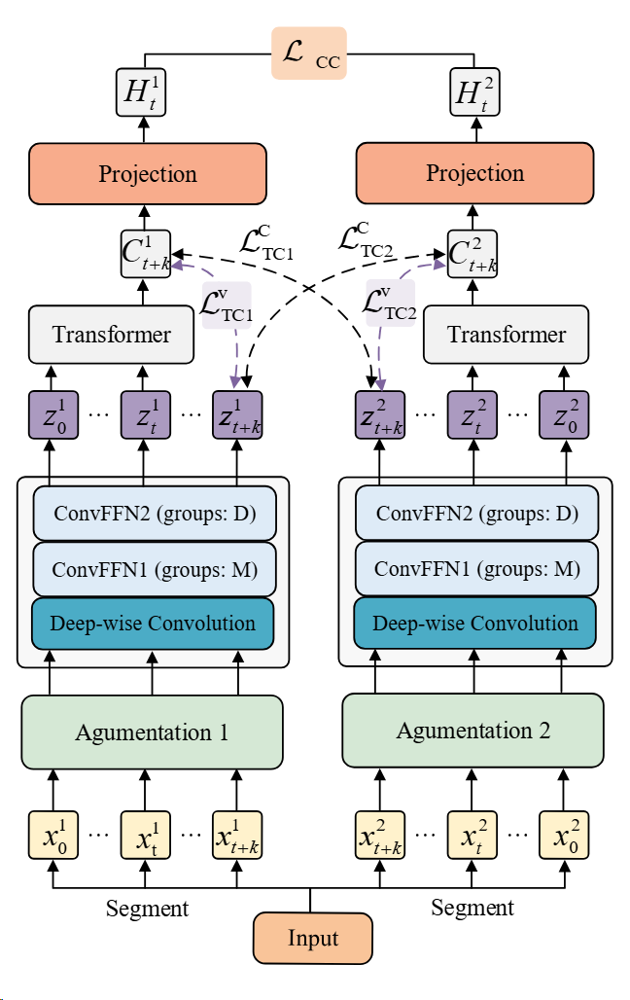

## MLTVD: Multi-level Contrastive Representation Learning with Temporal–Variable Decoupling for Multivariate Time Series

## Framework

## Environment Settings
This implementation is based on Python3. To run the code, you need the following dependencies:

* python 3.8
* torch 1.13.0

## MLTVD
python train.py

## Multivariate Time Series data

You can get the UEA dataset [here](http://timeseriesclassification.com/dataset.php "访问数据集"). Different data belong to different types. For example, Wearable Human Activity Recognition (HAR) is an important field of research in smart assistive technologies. The details description is shown in the fllows:

| Datasets (short) | Datasets | ID | Train | Test | Dim | Length | Class |
|----------|----------------|---------|------|-----|--------|----------|--------|
| AWR      |ArticularyWordRecognition| 1      |275|   300|9     | 144|25
| EC       |EthanolConcentration| 2      |261|   263|3     |1751 |4
| FD       |FaceDetection| 3      |5890| 3524|144   |62 |2
| FM       |FingerMovements| 4      |316|  100 |28    |50 |2
| HMD      |HandMovementDirection| 5      |160|  74  |10    |400 |4
| HB       |HeartBeat| 6      |204|  205 |61    |405 |2
| PEMS     |PEMS_SF| 7      |267|  173 |963   |144 |7
| RS       |RacketSports| 8      |151|  152 |6     |30  |4
| SRS1     |SelfRegulationSCP1| 9      |268|  293 |6     |896 |2
| SRS2     |SelfRegulationSCP2| 10     |200|  180 |7     |1152|2
